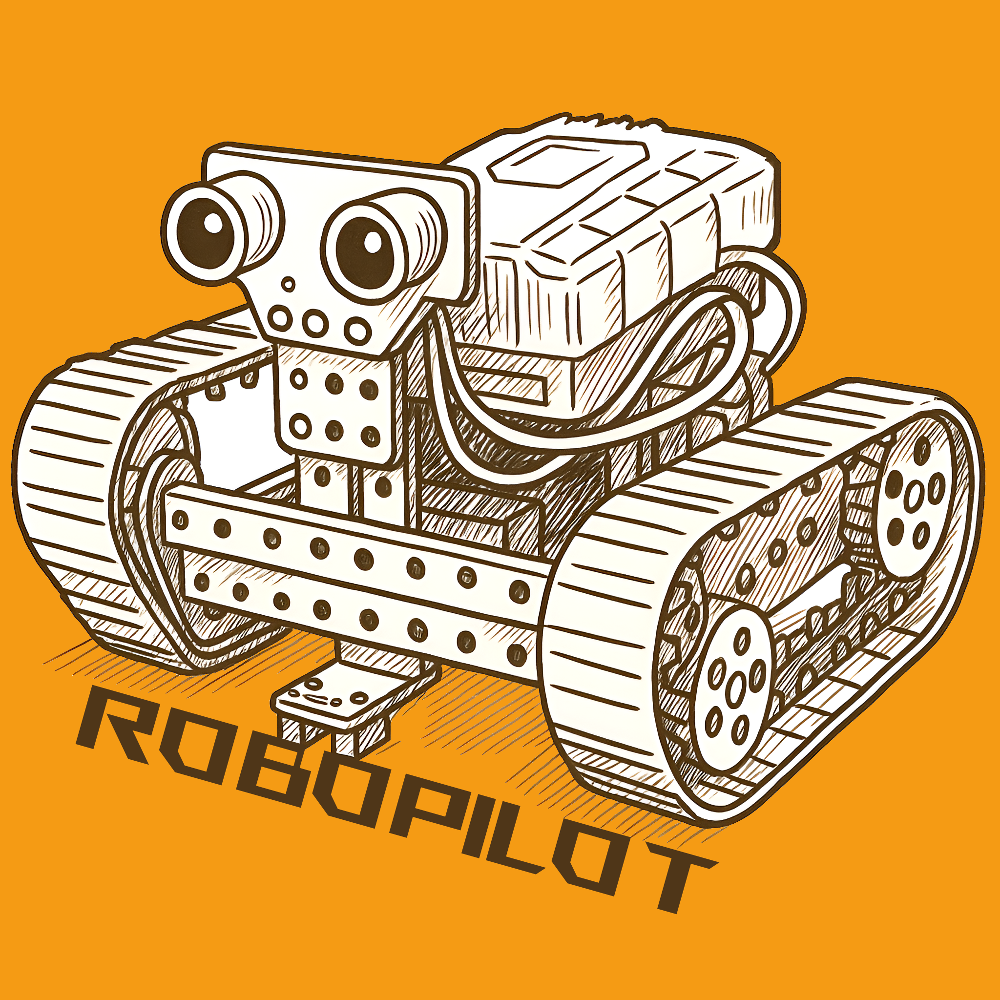

# Robo Pilot – Android Robotik Projekt

Robo Pilot ist eine Android-App zur Steuerung eines mobilen Roboters via Bluetooth.
Das Projekt wurde im Rahmen des Moduls **Android Robotik Projekt** an der Hochschule Bonn-Rhein-Sieg (HBRS) entwickelt.

Die App ermöglicht sowohl eine manuelle Steuerung des Roboters als auch einen autonomen Kameramodus, bei dem der Roboter einem roten Objekt folgt.

## Funktionen der App

### Manuelle Steuerung (Analog Control)

Die App bietet mehrere Möglichkeiten zur direkten Steuerung des Roboters:
- Buttons (Klassische Vorwärts-, Rückwärts-, Links-, Rechts-Befehle)
- Joystick (Stufenlose Richtungs- und Geschwindigkeitskontrolle)
- Gyroskop (Bewegung des Roboters durch Neigen des Smartphones)

### Autonome Kamera Steuerung
Der Roboter kann mithilfe der Smartphone-Kamera autonom gesteuert werden.

Roter Objekt-Tracker
- Echtzeit-Erkennung roter Objekte im Kamerabild
- Segmentierung und Connected-Component-Analyse
- Auswahl des größten erkannten Objekts als Ziel
- Visuelle Markierung des erkannten Objekts
- Automatische Bewegungssteuerung basierend auf Objektposition

Autonome Bewegungslogik
Der Roboter:
- folgt einem roten Ball
- dreht sich zur Objektmitte
- stoppt oder fährt rückwärts bei zu geringem Abstand
PID-basierte Regelung für sanfte Richtungsanpassung

## Autoren
- [Christian Haubrichs](https://github.com/MadlifeChrisis)
- [Bernhard Winkelhake](https://github.com/Bernhard-Winkelhake)
- [Oliver Groß](https://github.com/OliverCro)
